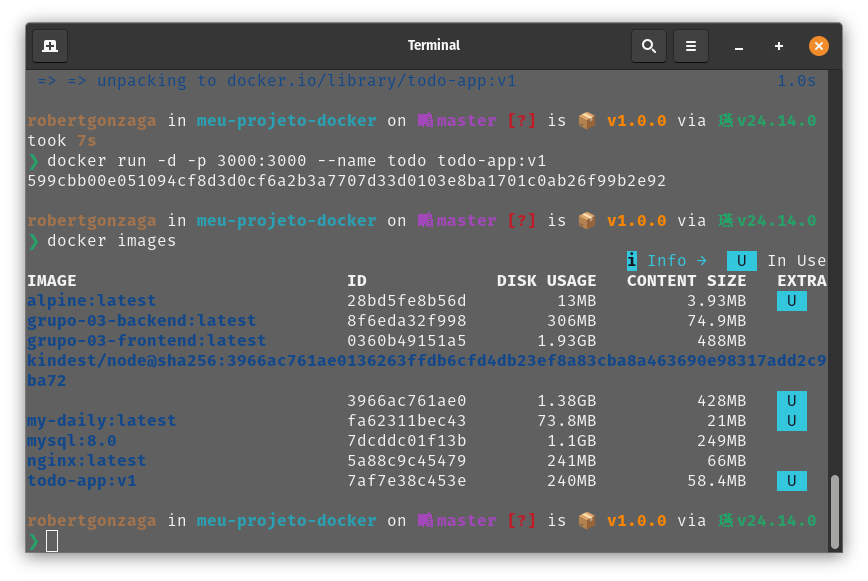
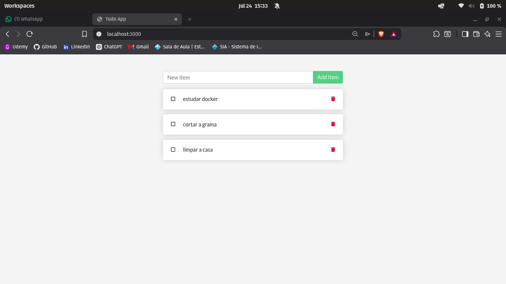
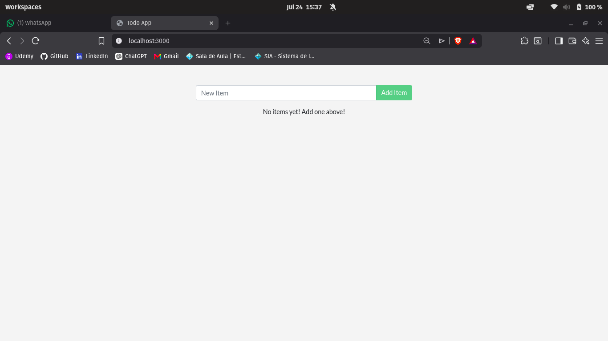
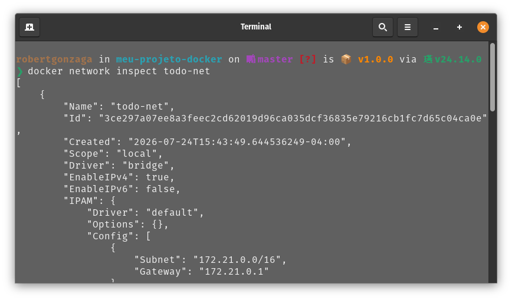
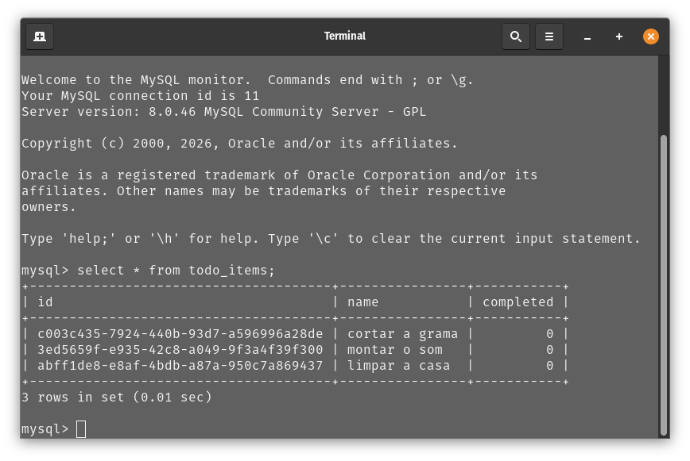
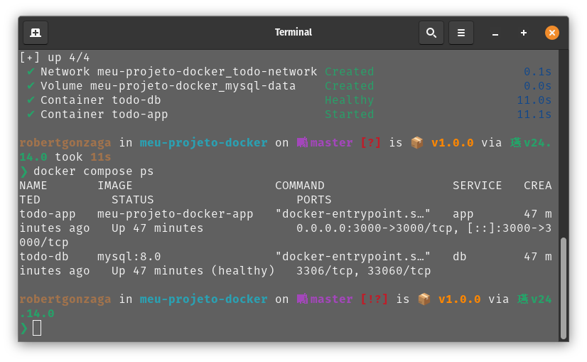
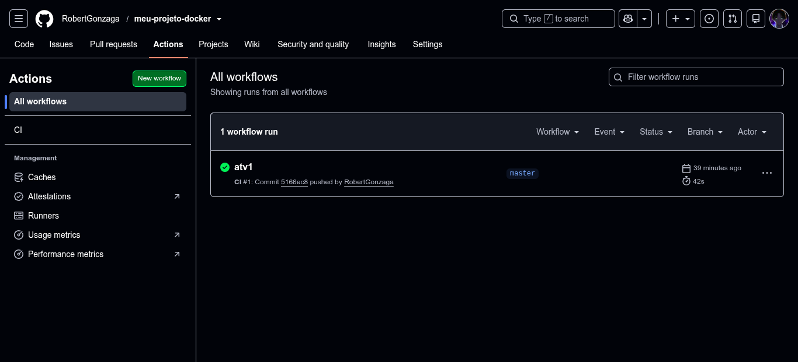
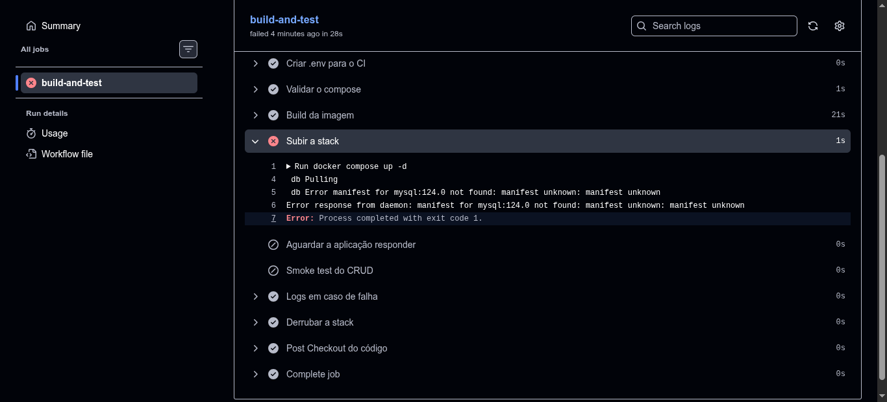

# Atividade Docker + CI

> **Instruções de preenchimento:**  
> Preencha todos os campos marcados com `[...]` e substitua as imagens de exemplo pelas suas.  
> Salve todas as imagens na pasta `docs/imagens/` e mantenha os nomes de arquivo indicados abaixo.

---

## 👤 Identificação

- **Aluno(a):** [Robert Gonzaga Albuquerque Ferreira]
- **Data:** [24/07/2026]
- **Aplicação usada:** [docker/getting-started-app — To-Do em Node.js]

---

## 1. Como executar este projeto

```bash
# Clone o repositório
git clone [https://github.com/RobertGonzaga/meu-projeto-docker]

# Acesse a pasta do projeto
cd [meu-projeto-docker]

# Crie o arquivo de variáveis de ambiente
cp .env.example .env

# Suba a aplicação com Docker Compose
docker compose up -d --build
```

- **Acesse a aplicação:** [http://localhost:3000](http://localhost:3000)
- **Para derrubar (mantendo dados):** `docker compose down`
- **Para derrubar (apagando dados):** `docker compose down -v`

---

## 2. Imagem e Dockerfile Multi-stage

- **Estágios utilizados:** [ex.: builder (instala dependências) e estágio final (runtime enxuto)]
- **Imagem base:** [node:20-alpine]
- **Usuário de execução:** [node, não-root]
- **Tamanho final da imagem:** [58.4MB]

> **Por que o multi-stage ajuda?**  
> [Diminui o tamanho e deixa mais seguro, usando apenas o necessario.]

### Evidências

**Print 1 — build + docker images**  


**Print 2 — aplicação rodando com tarefas cadastradas**  


---

## 3. Volumes e Persistência

- **Volume usado:** `[mysql-data]` → montado em `[/var/lib/mysql]`

> **Diferença entre `docker compose down` e `docker compose down -v`:**  
> [o comando com o argumento -v derruba o volume junto]

### Evidências

**Print 3 — SEM volume: dados perdidos ao recriar o container**  


**Print 4 — COM volume: dados preservados**  


---

## 4. Rede

- **Rede criada:** `[todo-network]`
- **Serviços conectados:** `[app e db]`
- **A porta do banco está exposta ao host?** [Não. A porta do MySQL não é publicada para o host porque apenas o serviço `app` precisa acessar o banco através da rede interna do Docker, o que aumenta a segurança.]

> **Por que o app consegue chamar o host mysql / db sem saber o IP?**  
> [Porque o Docker Compose cria uma rede interna com DNS embutido, permitindo que os containers se comuniquem usando o nome do serviço (como `db`) em vez do endereço IP.]

### Evidências

**Print 5 — docker network inspect**  


**Print 6 — dados dentro do MySQL (`SELECT * FROM todo_items;`)**  


---

## 5. Docker Compose

- **Serviços:** `app`, `db`
- **Rede:** `[todo-network]`
- **Volume:** `[mysql-data]`
- **Healthcheck em:** `db`
- **`depends_on` com:** `condition: service_healthy`
- **Variáveis sensíveis:** carregadas via `.env` (não versionado). Modelo disponível em `.env.example`.

### Evidências

**Print 7 — docker compose ps**  


---

## 6. Integração Contínua (GitHub Actions)

- **Arquivo do workflow:** `.github/workflows/ci.yml`
- **Gatilhos:** `push` e `pull_request`

### Etapas do Pipeline:

1. [valida o compose]
2. [builda a imagem]
3. [sobe a stack]
4. [aguarda a app responder e testa criar uma tarefa via API]
5. [derruba a stack]

### Evidências

**Print 8 — execução verde (sucesso)**  


---

## 7. Quebra Proposital do CI

- **O que eu quebrei:** [Alterei propositalmente a imagem do banco de dados no compose.yaml, trocando mysql:8.0 por uma tag inválida (mysql:124.0), fazendo com que o Docker não conseguisse iniciar o serviço do banco.]
- **Erro que apareceu no log:**
  ```text
  [manifest for mysql:124.0 not found: manifest unknown]
  ```
- **Como o CI reagiu:** [O pipeline falhou na etapa Subir a stack (docker compose up -d), pois o Docker não conseguiu baixar a imagem especificada para o serviço db.]
- **Como eu corrigi:** [alterei para mysql:8.0 novamente]
- **Link do Pull Request:** (https://github.com/RobertGonzaga/meu-projeto-docker/pull/1)

### Evidências

**Print 9 — execução vermelha (falha) + log do erro**  


---

## 8. Dificuldades e Aprendizados

[A maior dificuldade foi configurar corretamente o Dockerfile e ajustar as permissões para executar a aplicação com um usuário não-root, além de fazer a comunicação entre a aplicação e o banco de dados no Docker Compose. Resolvi esses problemas analisando os logs dos containers e corrigindo as configurações de permissões e do compose.yaml. Após a atividade, ficou mais claro como Dockerfile, volumes, redes e Docker Compose trabalham juntos para criar um ambiente isolado, reproduzível e fácil de implantar.]

---

## 9. Checklist de Autoavaliação

- [ ] Dockerfile multi-stage funcionando
- [ ] `.dockerignore` presente
- [ ] Container não roda como root
- [ ] Volume nomeado + persistência demonstrada
- [ ] Rede nomeada + banco não exposto ao host
- [ ] `compose.yaml` sobe tudo com um comando
- [ ] `.env` no `.gitignore` e `.env.example` versionado
- [ ] CI verde
- [ ] PR com CI vermelho documentado
- [ ] Todos os 9 prints no README
